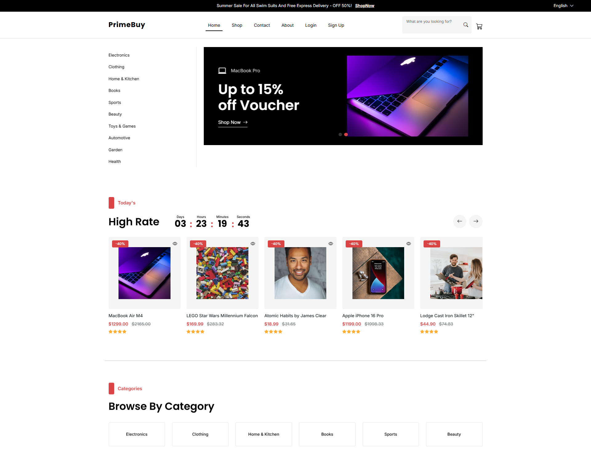
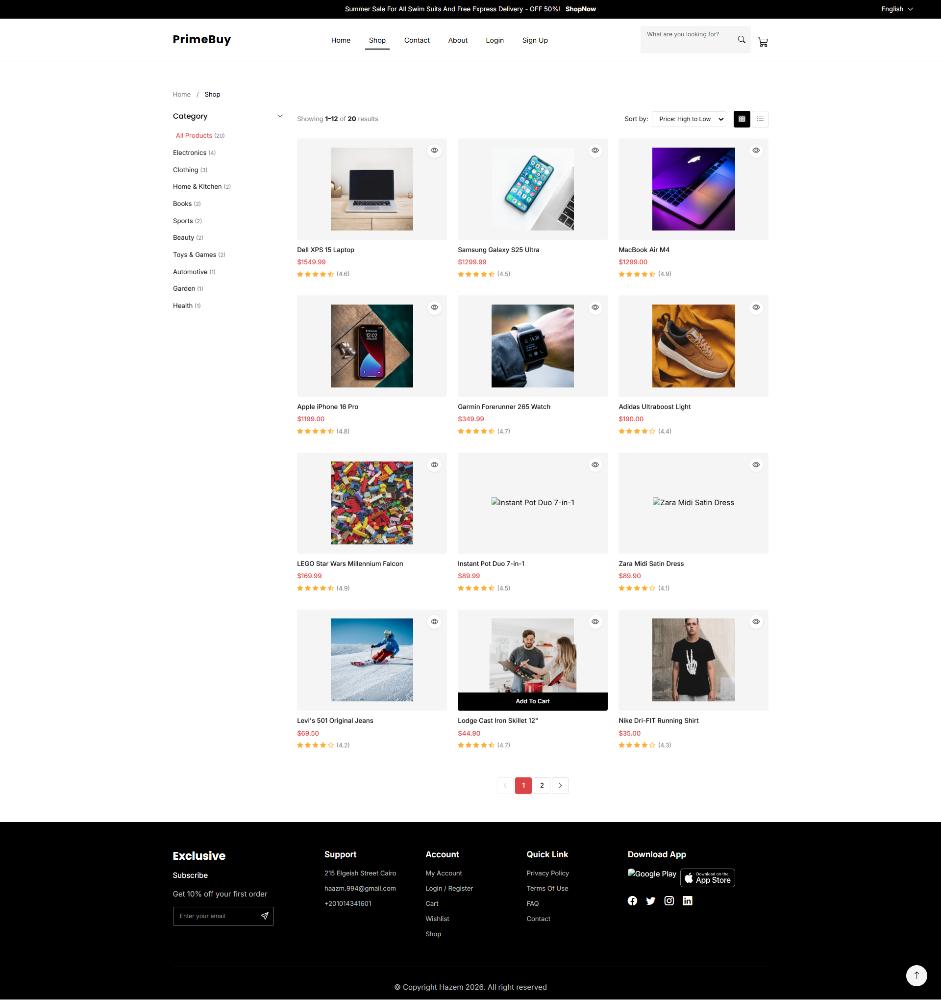
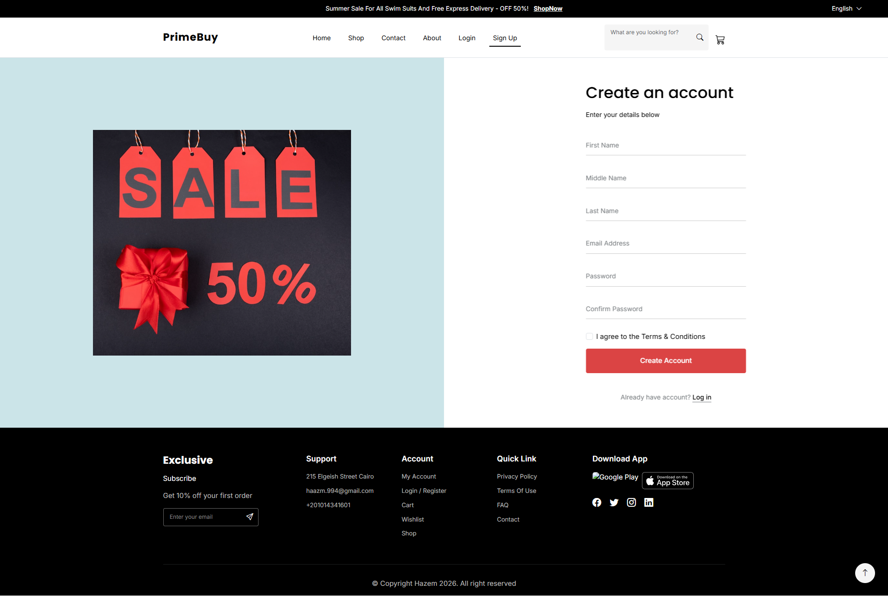
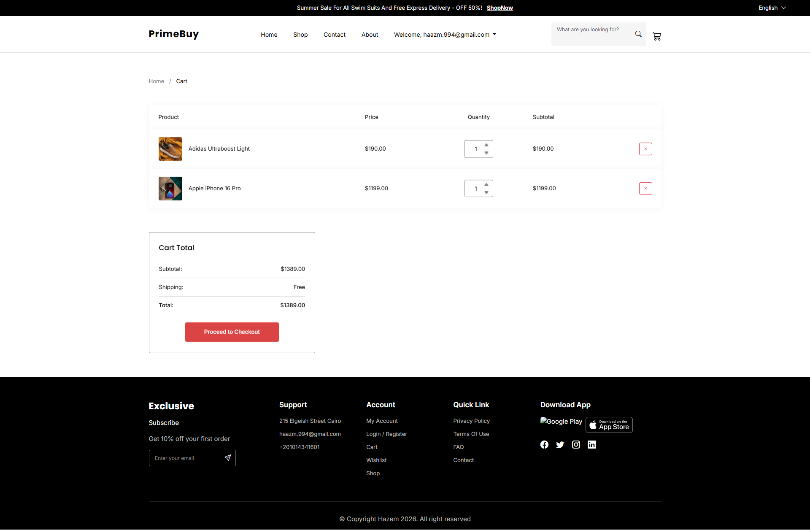
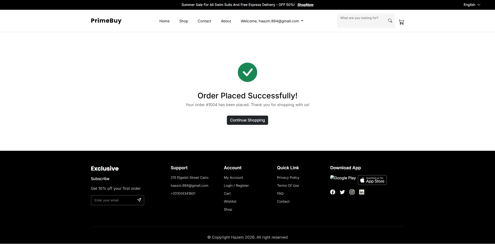
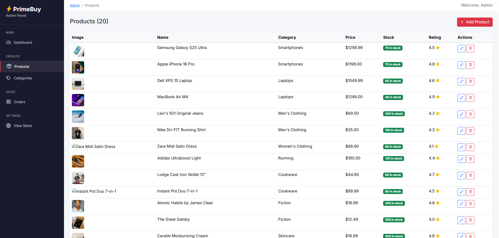

<div align="center">

# 🛒 PrimeBuy — E-Commerce System

A full-featured e-commerce web application built with **ASP.NET Core MVC** following **Clean Architecture** principles. PrimeBuy offers a complete shopping experience with product browsing, cart management, order processing, and an admin dashboard.

## Tech Stack


</div>

---

## 📖 Description

**PrimeBuy** is a modern, full-stack e-commerce platform designed for a seamless online shopping experience. It includes user authentication with role-based access control, a rich product catalog with filtering and sorting, a real-time shopping cart, a checkout flow with address management, order tracking, and a comprehensive admin panel for managing products, categories, and orders.

### Key Features

- **Home Page** : Hero carousel, highest-rated products, best-selling items
- **Shop** : Category filtering, keyword search, multi-criteria sorting, grid/list views, pagination
- **Product Details** : Full product information with star ratings, stock status, and add-to-cart
- **Shopping Cart** : Add/remove items, update quantities, real-time price calculation
- **Checkout** : Shipping address form, order summary, and order confirmation
- **User Account** : Registration, login, profile editing, password management
- **Order History** : View past orders with detailed order items and status tracking
- **Admin Dashboard** : Product/category/order CRUD, revenue stats, role-based access

---

## 🏗️ Project Architecture

This project follows **Clean Architecture** (also known as Onion Architecture), ensuring separation of concerns and a maintainable, testable codebase.

```
┌─────────────────────────────────────────────────────┐
│                  PrimeBuy.Web                       │
│          (Presentation / UI Layer)                  │
│   Controllers · Views · ViewModels · Program.cs     │
├─────────────────────────────────────────────────────┤
│              PrimeBuy.Infrastructure                │
│            (Infrastructure Layer)                   │
│            Repositories · DbContext  · Migrations   │
├─────────────────────────────────────────────────────┤
│              PrimeBuy.Application                   │
│            (Application / Business Layer)           │
│    Service Interfaces · Repository Interfaces       │
│       Services · UnitOfWork · DTOs                  │
├─────────────────────────────────────────────────────┤
│                PrimeBuy.Domain                      │
│              (Domain / Core Layer)                  │
│         Entities · Enums · Value Objects            │
└─────────────────────────────────────────────────────┘
```

### Layer Dependency Rule

Dependencies point **inward** — outer layers depend on inner layers, never the reverse:

```
Web → Infrastructure → Application → Domain
```

| Layer | Project | Responsibility |
|-------|---------|----------------|
| **Domain** | `PrimeBuy.Domain` | Entities (`Product`, `Category`, `Order`, `Cart`, etc.), Enums, no external dependencies |
| **Application** | `PrimeBuy.Application` | Service interfaces, repository interfaces, business services (`ProductService`, `CategoryService`), UnitOfWork contract, DTOs |
| **Infrastructure** | `PrimeBuy.Infrastructure` | EF Core `AppDbContext`, repository implementations, , UnitOfWork, data seeding, migrations |
| **Web** | `PrimeBuy.Web` | ASP.NET Core MVC controllers, Razor views, view models, DI configuration, Identity setup, admin area |


### Design Patterns Used

- **Clean Architecture** — Layered separation of concerns
- **Repository Pattern** — Abstracted data access via `IGenericRepository<T>`
- **Unit of Work** — Coordinated transaction management across repositories
- **Dependency Injection** — Built-in ASP.NET Core DI container


## 📸 Screenshots

<!-- Replace the placeholders below with your actual screenshots -->

### Home Page
> 

### Shop Page
> 

### Account Register
> 

### Shopping Cart
> 

### Checkout
> 

### Admin Dashboard
> 


---

## 🛠️ Tech Stack

| Technology | Purpose |
|:-----------|:--------|
|  | Primary programming language |
|  | Runtime framework |
|  | Web framework (Controllers + Razor Views) |
|  | ORM — LINQ-based data access |
|  | Relational database |
|  | Authentication & role-based authorization |
|  | Responsive front-end UI framework |
|  | Markup language |
|  | Styling |
|  | Client-side interactivity & AJAX |
|  | DOM manipulation & AJAX calls |


---

## 🚀 How To Run

### Prerequisites

- [.NET 10 SDK](https://dotnet.microsoft.com/download/dotnet/10.0) or later
- [SQL Server](https://www.microsoft.com/en-us/sql-server/sql-server-downloads) (LocalDB, Express, or full edition)
- [Visual Studio 2022+](https://visualstudio.microsoft.com/) or [VS Code](https://code.visualstudio.com/) with C# Dev Kit

### Steps

1. **Clone the repository**

   ```bash
   git clone https://github.com/Hazem-Ahmed1/PrimeBuy-ECommerce-System.git
   cd PrimeBuy-ECommerce-System
   ```

2. **Update the connection string**

   Open `PrimeBuy.Web/appsettings.json` and update the `DefaultConnection` to match your SQL Server instance:

   ```json
   "ConnectionStrings": {
     "DefaultConnection": "Data Source=YOUR_SERVER_NAME;Database=PrimeBuy;Integrated Security=True;Trust Server Certificate=True"
   }
   ```

3. **Apply database migrations**

   ```bash
   cd PrimeBuy.Web
   dotnet ef database update --project ../PrimeBuy.Infrastructure
   ```

4. **Run the application**

   ```bash
   dotnet run --project PrimeBuy.Web
   ```

   Or open `PrimeBuy.slnx` in Visual Studio and press **F5**.

5. **Access the application**

   - **Website**: `https://localhost:5001` (or the port shown in the console)
   - **Admin Panel**: Navigate to `/Admin` and log in with:
     - **Email**: `admin@gmail.com`
     - **Password**: `123456@Hazem`

### Default Accounts

| Role | Email | Password |
|------|-------|----------|
| Admin | `admin@gmail.com` | `123456@Hazem` |

> The application automatically seeds roles (`Admin`, `User`), categories, products, and sample data on first run.

---

## 📁 Folder Structure

```
PrimeBuy-ECommerce-System/
├── PrimeBuy.Domain/              # Core entities & enums (no dependencies)
│   ├── Models/                   # Product, Category, Order, Cart, User, etc.
│   └── Enums/                    # OrderStatus
│
├── PrimeBuy.Application/         # Business logic & contracts
│   ├── Interfaces/
│   │   ├── Repositories/         # IGenericRepository<T>, IProductRepository, etc.
│   │   ├── Services/             # IProductService, ICategoryService, ICartService, IOrderService
│   │   └── UnitOfWork/           # IUnitOfWork
│   ├── Services/                 # ProductService, CategoryService
│   └── Common/                   # DeleteResult DTO
│
├── PrimeBuy.Infrastructure/      # Data access & external concerns
│   ├── Data/                     # AppDbContext, DataSeeder
│   ├── Repositories/             # GenericRepository<T>, ProductRepository, etc.
│   ├── Services/                 # CartService, OrderService
│   ├── UnitOfWork/               # UnitOfWork
│   └── Migrations/               # EF Core migrations
│
├── PrimeBuy.Web/                 # Presentation layer
│   ├── Controllers/              # Home, Shop, Product, Cart, Checkout, Account, Order
│   ├── Areas/Admin/Controllers/  # Dashboard, Product, Category, Order management
│   ├── Views/                    # Razor views
│   ├── ViewModels/               # HomeVM, ShopVM, ProductViewModel, etc.
│   ├── wwwroot/                  # Static files (CSS, JS, images)
│   └── Program.cs               # App startup & DI configuration
│
└── PrimeBuy.slnx                 # Solution file
```

---
